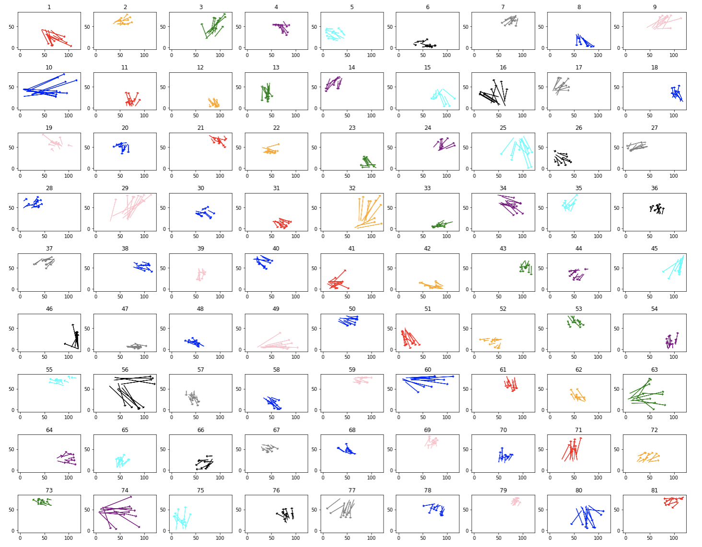
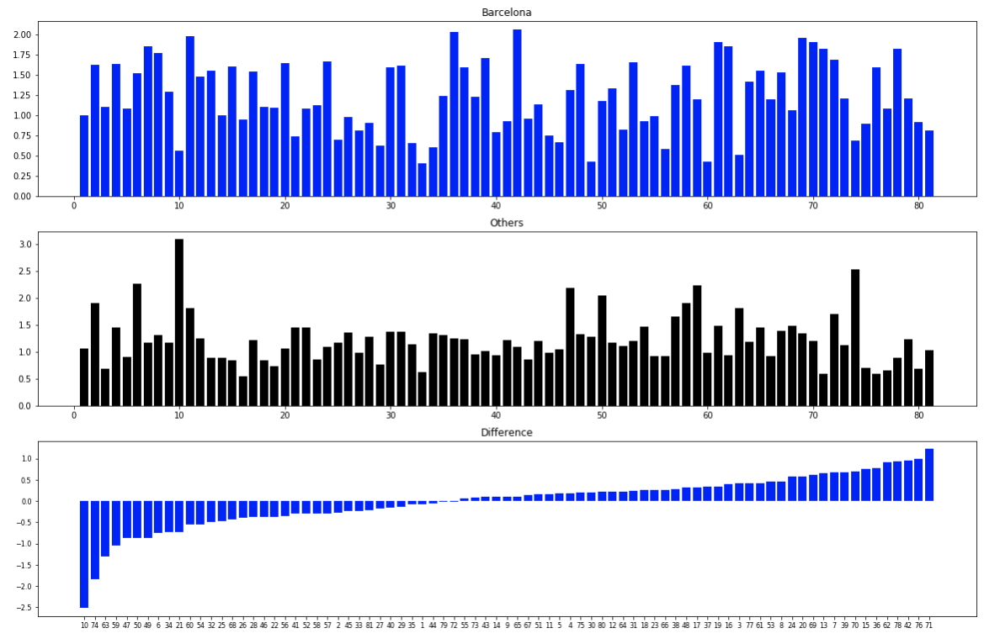

The k-means clustering algorithm is one of the most frequently used machine learning algorithms. It's purpose is to assign unlabelled data points, which posses quantitative features, into different groups. The algorithm achieves this grouping through an iterative process where k 'centroids' are calculated based on the data at hand. Each data point is then assigned to the group with the centroid it is most similar to. 

Among the many applications of this clustering algorithm, k-means can be used to cluster a soccer team's passes. In fact, using k-means, passes can be separated into groups based on their stating location, length and direction. This technique has been done many times in the past, but here, I apply it to Barcelona's passing data, provided by Statsbomb. 

The ultimate goal of this exercise is to determine what kind of passes Barcelona play more often (and less often) than their opponents. We can all agree that the peak of Barcelona's passing dominance came during the Pep-era, and so in this analysis, I'll use data from the 2011/12 season (Pep's last season in charge). 

The first step in acheiving the passing clusters is to calculate the actual centroids themselves. The centroids are calculated by feeding through all of Barcelona's passes, as well as their opponent's passes, into the k-means algorithm. 

**Important note:** I realize that this technique will mean that Barcelona's passes will weigh more heavily that those of their opponents in the calculation of the centroids, but given that Statsbomb only has Barcelona event-level data available for the 2011/12 La Liga season, I'll have to live with this limitation.

Luckily, python's sci-kit learn library has a great k-means clustering method. First though, I applied a standard scaler to the 4 features (x-starting position, y-starting position, length, direction) so that all features are weighed equally when clustering. Then, all that needed to be done was to choose the number of clusters and feed the data into the algorithm. In the end, through mostly visual inspection (the commonly used elbow-method did not prove to be very useful), I landed on **81 clusters**. You can see the 81 different clusters below: 

Having defined our clusters, the next step was to determine the percentage of Barcelona's passes which were assigned to each cluster, as well as their opponents' percentages. The two sets could then be compared, and their differences would reveal which pass clusters Barcelona play more often than their opponents, and vice-versa. The results are shown in the plots below:

